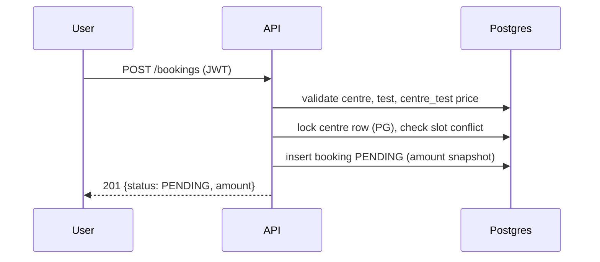
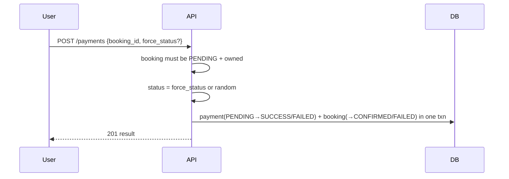
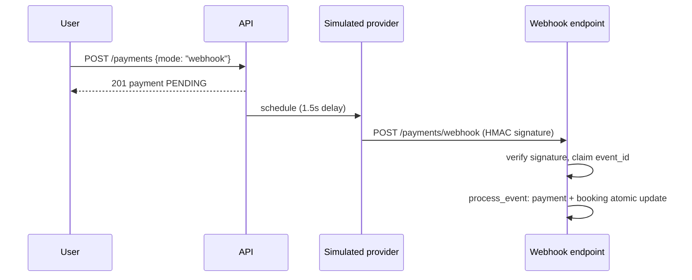

# Architecture

[[Home]] | [[API]] | [[Data-Model]] | [[Testing]]

## Stack

FastAPI + Uvicorn, SQLAlchemy 2.0, PostgreSQL 16 (psycopg 3), PyJWT, bcrypt, Pydantic v2. No Celery/Redis — background work runs in-process.

## Modules

```
app/
  main.py        app factory, lifespan (create_all + retry loop), envelope exception handlers
  config.py      pydantic-settings, env-driven
  database.py    engine, SessionLocal, Base, get_db
  models.py      SQLAlchemy models + status constants
  schemas.py     Pydantic request/response models
  errors.py      AppError + error-code → HTTP-status registry
  http.py        ok()/fail() envelope helpers (single enforcement point)
  security.py    bcrypt hashing, JWT create/decode
  deps.py        get_current_user, require_admin
  rate_limit.py  in-memory sliding window per IP
  background.py  webhook event processing, retry loop, simulated provider delivery
  seed.py        idempotent seed: admin, tests, centres, prices
  routers/       auth, centres (+admin), bookings, payments, webhooks
```

## Flows

### Booking



Price always comes from `centre_tests`; the client never supplies an amount.

### Payment (direct mode)



### Payment (webhook mode) — simulated provider



### Webhook idempotency + retry

1. `webhook_events.event_id` is the primary key — duplicates are impossible at the DB level.
2. Duplicate receipt → `200 {"processed": false, "reason": "ALREADY_PROCESSED"}` — nothing re-runs.
3. Event for unknown payment → stored as `FAILED` with `next_retry_at`; background loop retries with exponential backoff (2^n s, max 5 attempts), then `PERMANENTLY_FAILED`.
4. Conflicting status against a final payment (e.g. `FAILED` event after `SUCCESS`) → `PERMANENTLY_FAILED`, never applied. Matching status for a final payment → idempotent no-op `PROCESSED`.
5. Amount in payload, when present, must equal the payment amount — mismatch is permanent-failed.

## Cross-cutting

- **Envelope**: every route returns `ok()`/`fail()`; exception handlers map `AppError`, `RequestValidationError`, `HTTPException`, and unhandled errors into the same envelope. See [[API]].
- **Auth**: JWT bearer, 24h expiry. `require_admin` guards `/admin/*`.
- **Rate limiting**: in-memory sliding window per IP (`# ponytail:` single-process only).
- **Money**: integer paise in DB, rupees at the API edge.
- **Time**: naive UTC everywhere; inputs converted via `to_utc_naive`.
