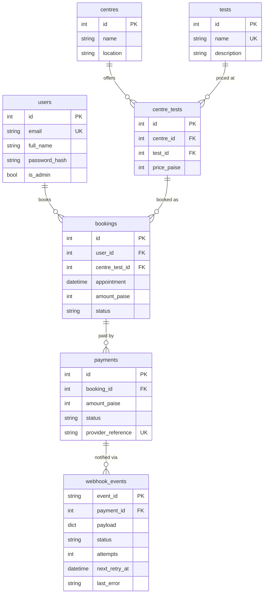
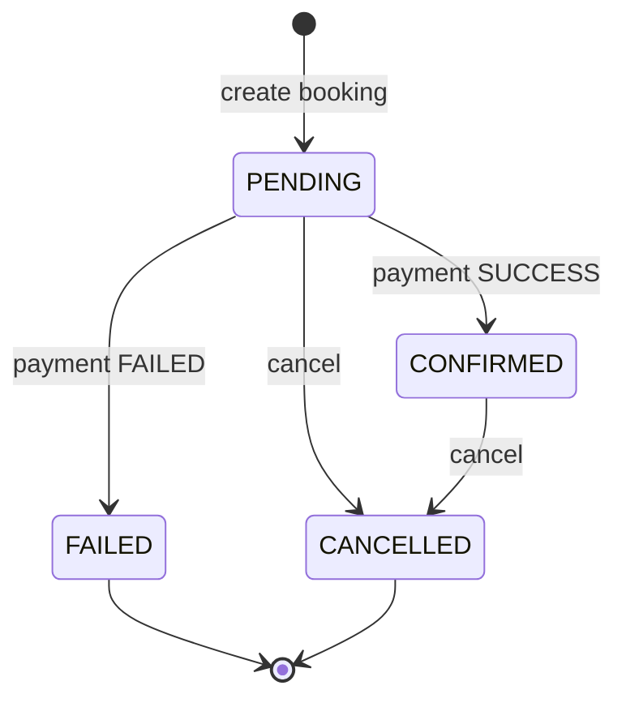
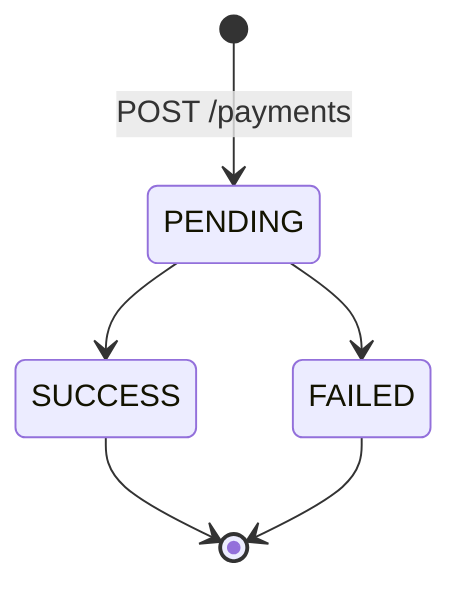
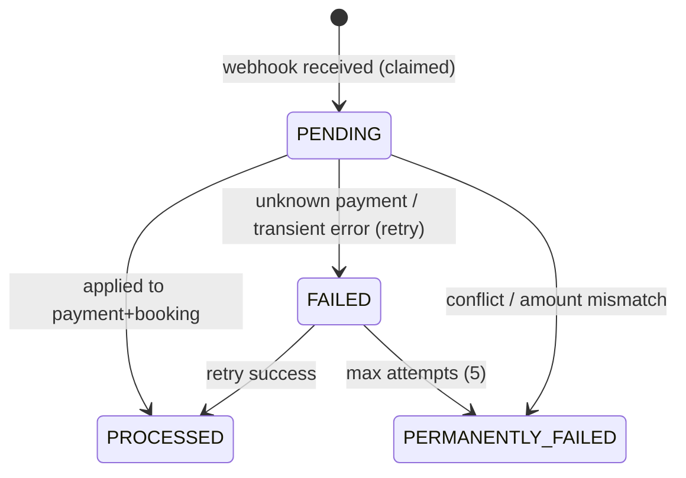

# Data Model

[[Home]] | [[Architecture]] | [[API]]

## Design points

- **Price lives on `centre_tests`** — same test, per-centre price. `UNIQUE(centre_id, test_id)`.
- **Money as integer paise** everywhere in the DB; API exposes rupees (`500.00`). No float money.
- **Booking amount is a snapshot** of the centre-test price at booking time — later price changes never alter existing bookings.
- **Timestamps naive UTC**; appointments normalized via `to_utc_naive`.

## State machines

## Constraints & guards

- Active bookings (`PENDING`/`CONFIRMED`) hold the centre+appointment slot; cancellation frees it. Centre row locked with `FOR UPDATE` on Postgres during booking.
- Cancel is blocked while a payment is `PENDING` for the booking.
- `webhook_events.event_id` PK makes duplicate delivery impossible at the DB level.
- `payments.provider_reference` unique (uuid hex) per attempt.
